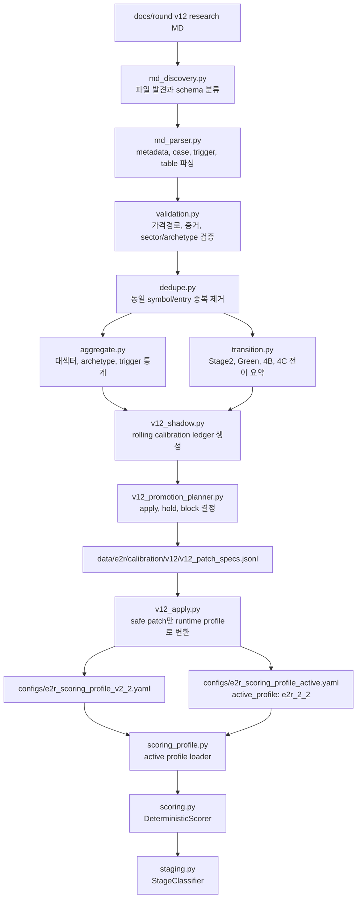
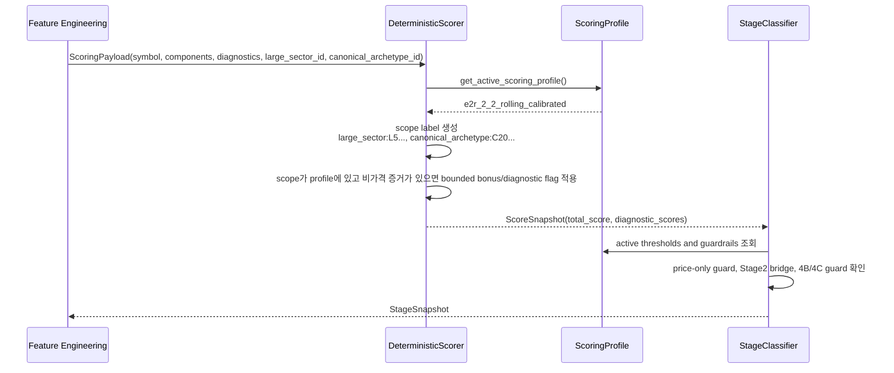

# E2R V12 Rolling Calibration Architecture

이 문서는 `docs/round`에 쌓이는 v12 연구 MD가 실제 점수체계와 Stage 판정까지 어떻게 연결되는지 고정한 운영 문서다.

핵심 결론은 단순하다.

```text
연구 MD를 쌓기만 하는 구조가 아니다.
run-v12-calibration 한 번으로 검증, 중복제거, 전이분석, 패치생성, E2R 2.2 active profile 반영까지 간다.
```

현재 기본 active profile은 다음과 같다.

```text
configs/e2r_scoring_profile_active.yaml
active_profile: e2r_2_2
rollback_profile: calibrated
```

따라서 v12의 표준 작업 명령은 이것이다.

```bash
PYTHONPATH=src python -m e2r.calibration.cli run-v12-calibration \
  --md-input-root docs/round \
  --data-directory data/e2r/calibration/v12 \
  --report-directory reports/e2r_calibration/v12
```

`run-v12-full`은 감사용 진단 명령이다. 기본 점수체계에 반영하려면 `run-v12-calibration`을 사용한다.

## 전체 흐름



예를 들어 `C22_INSURANCE_RATE_CYCLE_RESERVE` 연구가 들어오면 바로 Stage 기준 전체를 낮추는 게 아니다.

```text
1. 파일명과 metadata에서 C22 archetype을 읽는다.
2. trigger row가 검증을 통과한다.
3. 같은 symbol, 같은 entry의 반복 row는 대표 1개로 줄인다.
4. C22의 성공/반례/4B/4C 전이를 집계한다.
5. apply_next_patch로 판정된 축만 v2.2 profile에 들어간다.
6. 실제 런타임 payload에 canonical_archetype_id=C22...가 붙고 비가격 증거가 있을 때만 보정이 작동한다.
```

## 코드 호출 지도

| 단계 | 코드 | 입력 | 출력 |
|---|---|---|---|
| 명령 | `src/e2r/calibration/cli.py` | CLI 인자 | 전체 파이프라인 실행 |
| 발견 | `md_discovery.py` | `docs/round/**/*.md` | `MarkdownDocument` 목록 |
| 파싱 | `md_parser.py` | v12 MD | raw case, trigger, residual row |
| 검증 | `validation.py` | raw trigger rows | validated rows, rejected rows |
| 중복제거 | `dedupe.py` | validated rows | representative rows |
| 집계 | `aggregate.py` | representative rows | sector/archetype metrics |
| 전이 | `transition.py` | representative rows | stage transition summary |
| 후보장부 | `v12_shadow.py` | metrics, transitions | rolling ledger, candidate profile |
| 패치결정 | `v12_promotion_planner.py` | candidate rows | promotion decisions, patch specs |
| 반영 | `v12_apply.py` | patch specs | v2.2 profile, active profile |
| 런타임 로드 | `scoring_profile.py` | active yaml | active `ScoringProfile` |
| 점수 | `scoring.py` | `ScoringPayload` | `ScoreSnapshot` |
| Stage | `staging.py` | `ScoreSnapshot`, RedTeam | `StageSnapshot` |

## 데이터 산출물

`run-v12-calibration`은 다음 파일을 만든다.

| 파일 | 의미 |
|---|---|
| `data/e2r/calibration/v12/v12_md_registry.jsonl` | 어떤 v12 MD를 읽었는지 |
| `data/e2r/calibration/v12/v12_extracted_triggers_raw.jsonl` | 파싱된 원본 trigger row |
| `data/e2r/calibration/v12/v12_trigger_rows_validated.jsonl` | 검증 통과 row |
| `data/e2r/calibration/v12/rejected_v12_rows.jsonl` | 탈락 row와 이유 |
| `data/e2r/calibration/v12/v12_trigger_rows_representative.jsonl` | 중복제거 후 대표 row |
| `data/e2r/calibration/v12/v12_aggregate_metrics.json` | 대섹터와 archetype별 통계 |
| `data/e2r/calibration/v12/stage_transition_summary.jsonl` | Stage2, Green, 4B, 4C 전이 요약 |
| `data/e2r/calibration/v12/v12_promotion_decisions.jsonl` | apply, hold, block 판정 |
| `data/e2r/calibration/v12/v12_patch_specs.jsonl` | 실제 적용 가능한 safe patch |
| `configs/e2r_scoring_profile_v2_2.yaml` | E2R 2.2 rolling runtime profile |
| `configs/e2r_scoring_profile_active.yaml` | active profile 선택 |

보고서는 다음 위치에 쌓인다.

```text
reports/e2r_calibration/v12/
```

가장 먼저 볼 파일은 다음 네 개다.

```text
ingest_summary.md
apply_next_patch_plan.md
rolling_calibration_apply_report.md
blocked_axes_report.md
```

## Patch Decision

v12 row는 바로 점수로 들어가지 않는다. 반드시 `v12_promotion_planner.py`에서 네 가지 중 하나로 분류된다.

| decision | 의미 | 다음 행동 |
|---|---|---|
| `apply_next_patch` | 지금 적용 가능한 작은 패치 | `v12_patch_specs.jsonl`에 기록 후 v2.2 profile 반영 |
| `hold_for_more_evidence` | 근거 수가 아직 부족 | 해당 sector/archetype 연구 추가 |
| `blocked_by_data_quality` | URL, source proxy, 가격경로 등 데이터 품질 문제 | 증거 URL, 가격, as-of 근거 보강 |
| `blocked_by_logic_risk` | E2R 철학상 위험 | Green 제한, RedTeam guard 강화 |

예시는 이렇다.

```text
C20 K뷰티 positive가 많지만 source proxy가 높다.
-> hold 또는 blocked_by_data_quality.

C22 보험은 positive/counterexample 균형과 전이 경로가 충분하다.
-> apply_next_patch.

price-only 테마 급등 row가 많다.
-> Stage2 보너스가 아니라 local_4b_watch_guard 또는 Green 차단 guard.
```

## Patch Axis

현재 v2.2에 들어갈 수 있는 safe axis는 여섯 개다.

| axis | 런타임 의미 |
|---|---|
| `stage2_bonus_candidate_delta` | 해당 scope에서 비가격 증거가 있을 때 Stage2 근처에 최대 +1 |
| `stage2_required_bridge` | 해당 scope에서 Stage2가 되려면 비가격 bridge 필요 |
| `local_4b_watch_guard` | price-only blowoff는 positive Stage 또는 full 4B로 올리지 않음 |
| `full_4b_overlay_candidate` | full 4B는 비가격 증거가 있어야 인정 |
| `earlier_thesis_break_watch` | hard 4C 전 단계의 thesis-break watch 강화 |
| `hard_4c_confirmation` | 비가격 thesis-break 확인 시 4C 판정 강화 |

Stage 3-Green 기준은 v12에서 낮추지 않는다.

```text
Green을 쉽게 만들기 위한 패치가 아니라,
Stage2/Yellow 관찰을 더 빨리 잡고
4B/4C와 가격만 오른 false positive를 더 잘 막는 패치다.
```

## Runtime Scoring Flow



중요한 연결 조건은 `large_sector_id`와 `canonical_archetype_id`다.

```text
payload에 canonical_archetype_id가 없으면 C20, C22 같은 scope patch가 작동할 수 없다.
```

쉬운 예시는 이렇다.

```text
payload A:
  canonical_archetype_id = C22_INSURANCE_RATE_CYCLE_RESERVE
  evidence_family_financial_actual = 1
  evidence_family_disclosure = 1
  eps_fcf_explosion >= Stage2 기준

결과:
  C22 Stage2 bonus scope가 있으면 최대 +1이 붙을 수 있다.

payload B:
  canonical_archetype_id = C22_INSURANCE_RATE_CYCLE_RESERVE
  price_only_blowoff_score = 80
  비가격 증거 없음

결과:
  +1 보너스 없음.
  Stage2/Stage3 positive 승격도 price-only guard에 막힌다.
```

## Safety Rules

이 파이프라인이 절대 하지 않는 것:

```text
종목명 하드코딩
benchmark label을 scoring input으로 사용
case library를 후보 생성 input으로 사용
Stage 3-Green 전역 기준 완화
미래 데이터 사용
가격만 오른 row를 Green이나 full 4B로 승격
투자 권고 문구 출력
자동매매 또는 증권사 API 연결
```

v12 적용은 scope 제한이다.

```text
전역 Stage2 기준을 낮추는 것이 아니다.
특정 대섹터 또는 archetype에 대해,
검증된 증거 조건이 맞을 때만 작은 보정이나 guard가 작동한다.
```

## 운영 Cadence

연구와 점수반영은 분리하지 않는다. 한 배치가 들어오면 바로 다음 순서로 돈다.

```text
1. 새 v12 MD를 docs/round에 추가한다.
2. run-v12-calibration을 실행한다.
3. apply_next_patch_plan.md에서 적용된 patch를 확인한다.
4. rolling_calibration_apply_report.md에서 active profile 변경을 확인한다.
5. blocked_axes_report.md에서 다음 연구가 필요한 곳만 본다.
6. 새 연구가 들어오면 같은 명령을 다시 실행한다.
```

이 구조에서는 “계속 쌓기만 하는 것”이 아니다.

```text
새 연구가 safe patch gate를 통과하면 바로 v2.2 profile에 들어간다.
통과하지 못하면 그 이유가 blocked_axes_report.md에 남는다.
```

## 현재 배치 상태

최근 실행 기준:

```text
v12_result_md_count: 87
v12_validated_trigger_rows: 960
v12_representative_trigger_rows: 748
stage_transition_summary_rows: 410
large_sectors_covered: 10
canonical_archetypes_covered: 27
applied_patch_count: 64
active_profile: e2r_2_2
rollback_profile: calibrated
```

적용 축:

```text
stage2_bonus_candidate_delta: 5
stage2_required_bridge: 22
local_4b_watch_guard: 9
full_4b_overlay_candidate: 9
earlier_thesis_break_watch: 19
hard_4c_confirmation: 0
```

## Naming Note

일부 내부 파일명에는 과거 호환 때문에 `shadow`가 남아 있다.

```text
sector_shadow_profile.json
archetype_shadow_profile.json
v12_shadow_weight_candidates.jsonl
```

하지만 현재 사용자-facing 의미는 passive shadow가 아니다.

```text
이 파일들은 rolling calibration ledger다.
run-v12-calibration은 이 장부에서 apply_next_patch를 뽑아 active E2R 2.2 profile에 실제 반영한다.
```

나중에 파일명까지 바꾸려면 migration이 필요하다. 현재는 기존 테스트와 산출물 호환을 위해 내부 파일명을 유지하고, 문서와 보고서의 의미를 rolling calibration으로 고정한다.

## Verification Checklist

문서나 파이프라인을 바꾼 뒤 최소 확인:

```bash
PYTHONPATH=src python -m unittest tests.test_calibration_v12_pipeline -v
PYTHONPATH=src python -m unittest tests.test_calibration_pipeline -v
PYTHONPATH=src python -m compileall -q src tests
git diff --check
```

코드 로직을 바꿨다면 전체 테스트도 실행한다.

```bash
PYTHONPATH=src python -m pytest
PYTHONPATH=src python -m unittest discover -s tests -v
```

